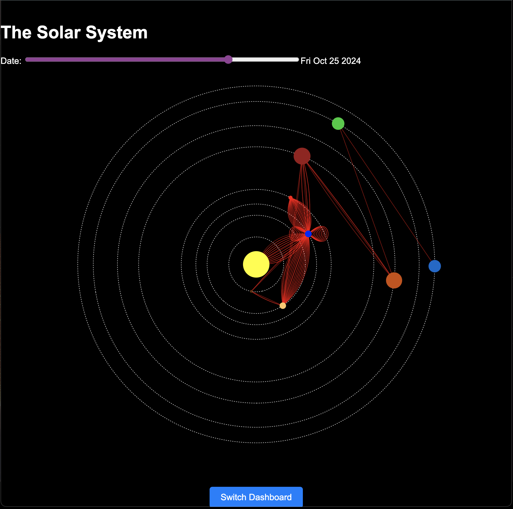
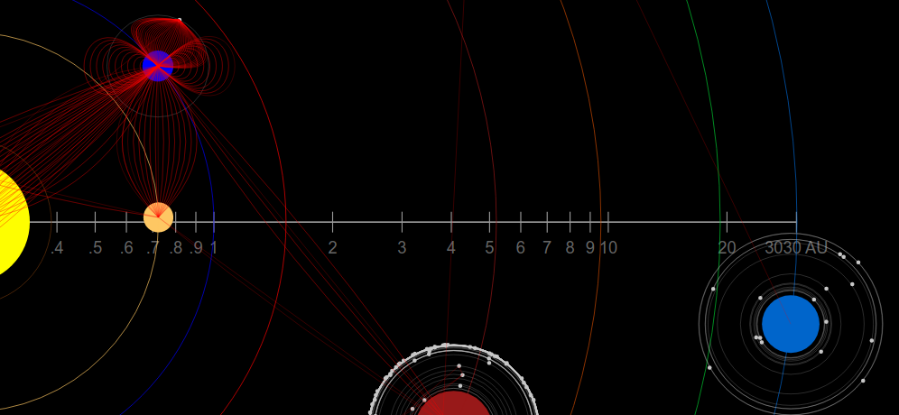
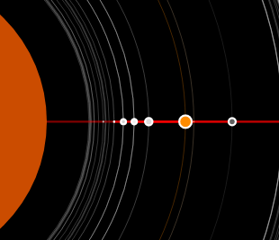

# Process Book - Space Mission Explorer

The aim of this project is to visualize space missions.

## Team Members

- Matthew Whitaker
    - email: matthew.whitaker@utah.edu
    - UID: 1251812

- Sarah Sami Khan
    - email: sarah.khan@utah.edu
    - UID: 1531711

- Simón González
    - email: u1528314@utah.edu
    - UID: 1528314

## Resources used for the project proposal

* [Project Ideas Document](https://docs.google.com/document/d/1pG8MIJ63O_l-x5lxE9TWMq5bsQBWVphontCbd75LPDg/edit?usp=sharing) contains the initial questions and design ideas. 
* [Project proposal assignment (Due next Friday Sept 13)](https://www.dataviscourse.net/2024/project/#project-proposal)
* [Link for data review](https://planet4589.org/space/gcat/index.html): use this to get an idea of what data is available to design the visualizations.

## Resources for design

- [Nasa Solar System Viewer](https://science.nasa.gov/solar-system/kuiper-belt/) for inspiration.
- [Earth orbit artificial objects viewer](https://whatsin.space/) for inspiration.
- [Solar System Viewer](https://www.solarsystemscope.com/) for inspiration.
- [How to choose colors for the visualizations?](https://blog.datawrapper.de/which-color-scale-to-use-in-data-vis/)

## Resources for development
- [Render millions of datapoints with D3](https://blog.scottlogic.com/2020/05/01/rendering-one-million-points-with-d3.html)
- [Check planet position calculations](https://www.fourmilab.ch/cgi-bin/Solar)
- [Good loooking images for planets](https://codepen.io/juliangarnier/pen/krNqZO)
- [More planet images](https://www.solarsystemscope.com/textures/)
- [Calculations tutorials](https://bits.ashleyblewer.com/blog/2018/05/05/mapping-the-planets/)
- [More calculations tutorials](https://stjarnhimlen.se/comp/tutorial.html)

## Overview and Motivation

This process book chronicles the development of "Space Mission Explorer," an interactive visualization tool designed to captivate space enthusiasts and the general public with a deeper understanding of space mission data. The project was inspired by the burgeoning public interest in space exploration, fueled by groundbreaking scientific discoveries and high-profile missions. Our goal was to create a visually engaging and informative tool that empowers users to explore our solar system and the missions that have ventured into its enigmatic depths.

## Related Work

Existing solar system viewers, such as the NASA Solar System Viewer and the Earth orbit artificial objects viewer, provided valuable insights into effective representations of celestial bodies, orbits, and spacecraft trajectories.

**include screenshots of other webpages**

## Questions

Our initial focus was on fundamental questions:

*   How can we effectively convey the scale and intricacy of the solar system?
*   How can we visualize space mission paths intuitively?

As we progressed, we delved into more specific inquiries:

*   What are the significant milestones of each mission?
*   How can we emphasize the unique attributes of different spacecraft?
*   What are the correlations between mission objectives and their trajectories?

## Data

### Data Sources

Planetary data was acquired from reliable sources [insert links or specific names], and space mission data was compiled from NASA API and JPL Horizons.

### Data Cleaning and Preprocessing

Data cleaning was essential to ensure compatibility and consistency:

*   **Date Standardization:** GCAT's unique date formats were parsed and converted to ISO-8601 for consistency.
*   **Object Relationships:** Relationships between objects and their parent objects (e.g., rockets, payloads) were mapped.
*   **Primary Payload Identification:** Logic was implemented to identify the "primary" payload of each mission, prioritizing human payloads, then pressurized payloads, and so on.

The cleaned data was stored in JSON format for efficient access within our JavaScript visualization.

### Calculating Planetary Positions

Accurately calculating planetary positions presented several challenges:

*   **Time Unit Inconsistencies:** Addressing inconsistencies in time units (years vs. days) within the data.
*   **Orbital Element Wrapping:** Handling the wrapping of orbital elements (e.g., from 360 to 0 degrees).
*   **Mean Anomaly Calculation:** Correcting errors in the initial mean anomaly calculation.
*   **Earth Ephemerides Artifacts:** Accounting for computational artifacts in Earth's ephemerides data due to the coordinate system's reliance on the autumnal equinox.

These issues were resolved, resulting in accurate planetary position calculations. The Python code for this process is available in the `calculate_planetary_positions.py` file.

### Exploratory Data Analysis (EDA)

We used Python with Matplotlib and Seaborn for EDA. Histograms of mission launch dates showed a concentration in the late 20th century, while scatter plots of mission duration versus distance traveled revealed the diverse complexities of mission types. These findings guided our inclusion of a timeline slider and color-coded mission types.

## Design Evolution

### Initial Exploration

We explored various visualization options, including:

*   A 3D model of the solar system
*   A network diagram of mission connections
*   A timeline-based representation of mission events

### Chosen Approach

We settled on a 2D interactive map for its clarity and ease of navigation. This design utilizes preattentive processing by using color to distinguish mission types and size to represent the planetary scale.

### Dashboard Structure

While our initial proposal focused on a single, comprehensive view, we later incorporated scatterplot and histogram visualizations to provide a focused exploration of planetary properties. This led to a two-dashboard structure:

*   **Dashboard 1:** The main solar system visualization with interactive elements.

*   **Dashboard 2:** A Data Explorer with scatterplots and histograms for deeper analysis.

### Prototype Iteration

Our prototyping process involved several key stages:

*   **First Prototype:** A basic visualization of the solar system with planets represented as colored circles on a dark background. 

*   **Planetary Positions:**  Incorporating accurate planetary positions into the visualization. 

*   **Mission Paths:** Visualizing mission paths using Bézier curves with control points. 
 

*   **Time Slider:** Introducing a time slider to allow users to dynamically change the date and observe the corresponding changes in planetary positions. 

### Interactive Elements

Our visualization features several interactive components crucial for user engagement and data exploration:

*   **Time Slider:** A vertical slider enables users to filter missions by launch date, dynamically visualizing the evolution of space exploration. 
[Include a screenshot]
*   **Accurate Planet Positions Toggle:** A toggle switch allows users to control the accuracy of planet positions, illustrating the complexities of orbital mechanics. 
[Include a screenshot]
*   **Zoom Controls:** Buttons for zooming in, zooming out, and resetting the zoom provide users with control over the visualization's scale, facilitating the exploration of both the inner and outer solar system. 
[Include a screenshot]
*   **Switch Dashboard:** A prominent button enables users to switch between Dashboard 1 (solar system visualization) and Dashboard 2 (Data Explorer). 
[Include a screenshot]

### Data Explorer

Dashboard 2 (Data Explorer) provides a dedicated space for users to delve deeper into the quantitative aspects of celestial bodies and missions. It includes:

*   **Scatterplots:** Users can visualize relationships between different variables (e.g., distance, radius, launch date) through interactive scatterplots. 
[Include screenshots]
*   **Histograms:** Histograms allow users to analyze the distribution of specific variables, gaining insights into patterns and trends. 
[Include screenshots]
*   **Variable Selection Dropdowns:** Users can dynamically choose which variables to display on the scatterplots and histograms, tailoring the exploration to their interests.

### Visualization Refinements

Throughout the development process, we made several refinements to enhance the visualization:

*   **Satellites:** Satellites were added to the visualization, represented as small circles orbiting planets. Challenges with visual clutter were addressed through color-coding, scale adjustments, zoom levels, and ordered placement.    

*   **Code Refactoring:** The codebase was refactored to improve organization and maintainability.

*   **Styling and Distance Scale:** Styles for orbits, planets, and controls were refined, and a distance scale was added to the map. 

*   **Time Slider Enhancement:** The time slider was enhanced with a mission count visualization and zoom controls. 

*   **Data Explorer Improvements:** Data transformations, filtering, and scale adjustments were implemented based on selected variables. Tooltips were added to scatterplots and histograms for data point details. Individual zoom functionality was added to each plot. 

*   **Data Enrichment:** Additional variables (gravity, average temperature, discovery date, discoverer, density) were added to the dataset to provide richer exploration opportunities.

*   **Selection Interactions:** Selection interactions were implemented to link the solar system map and the data explorer, highlighting selected objects in both views. 

 

*   **Tooltips:** Tooltips were designed to be informative and easy to read, providing relevant details about objects and missions. 

*   **Color Usage:** A high-contrast color scheme was employed throughout the visualization, with color used sparingly to highlight objects, mission paths, and selected elements in the data explorer.

*   **Final Refinements:** HTML layout was improved, interaction bugs were fixed, and a link to the video presentation was added to the main screen.

## Implementation

### Code Structure and Modules

Our project's codebase is structured using JavaScript modules to enhance organization and maintainability. The main script file (`script.js`) serves as the entry point and orchestrates the interaction between different components:

*   `solarSystemMap.js`: This module encapsulates all the logic and functionality related to the solar system map visualization (Dashboard 1).

*   `dashboard.js`: This module handles the creation and management of the Data Explorer (Dashboard 2), including the scatterplots, histograms, and variable selection elements.

This modular approach promotes code reusability, separation of concerns, and easier debugging.

### Dashboard Switching

The `script.js` file manages the dynamic switching between dashboards:

*   **Event Listener:** An event listener is attached to the "Switch Dashboard" button (`switchButton`).
*   **Dashboard State:** A variable (`currentDashboard`) tracks the currently active dashboard.
*   **Conditional Rendering:** Based on the `currentDashboard` value, the script shows or hides the respective dashboard elements (`dashboard1` and `dashboard2`).
*   **Visualization Setup:** The script ensures that the appropriate visualization setup function (`solarSystemMap.setup` or `dashboard.setup`) is called only once when the corresponding dashboard is first displayed.

### Time Slider Interaction

The `script.js` file also handles the interaction with the time slider:

*   **Event Listener:** An event listener is attached to the time slider (`timeSlider`).
*   **Value Update:** When the slider value changes, the script updates the `timeSliderText` element to display the current year.

### Selection Management

To enable coordinated highlighting and interaction between the solar system map and the data explorer, we implemented a selection management system within the `dashboard.js` module. This system allows different parts of the visualization to communicate and synchronize selections.

#### Key Components:

*   `globalState`:  A global object to store the currently selected objects (both celestial bodies and missions).
*   `listeners`: An array to store listener functions that need to be notified when selections change.
*   `SELECTION_TYPES`: An enum to define the types of selectable objects (BODY and MISSION).

#### Functions:

*   `suscribeToObjectSelection`: Allows components to subscribe to selection events for a specific object type.
*   `notifyAllToListener`: Notifies all subscribed listeners about the current selection state.
*   `updateObjectSelection`:  Updates the selection state when an object is clicked.
*   `clearSelection`: Clears all current selections.
*   `isObjectSelected`: Checks if a given object is currently selected.

#### Selection Mechanism:

1.  When an object (planet, mission) is clicked, the `updateObjectSelection` function is called.
2.  This function updates the `globalState` to reflect the new selection state.
3.  The function then notifies all subscribed listeners about the change in selection.
4.  Listeners (e.g., the solar system map and the data explorer) can then update their visualizations to highlight the selected objects.

This selection management system facilitates coordinated interactions and enhances the user's ability to explore connections between different aspects of the data.

### Core Features

*   **Zooming and Panning:** Users can zoom in and out of the solar system and pan across the visualization to explore different regions.
*   **Timeline Slider:** A slider allows users to filter missions by launch date, showing the evolution of space exploration over time.
*   **Mission Selection:** Clicking on a mission path displays detailed information about the mission in a tooltip, including its objectives, spacecraft details, and key events.
*   **Animations:** Planetary orbits are animated to provide a dynamic representation of the solar system.

## Evaluation

### Key Findings and Insights

Our visualization effectively communicates the scale of the solar system, the diversity of space missions, and the challenges of interplanetary travel. We identified trends in mission targets and observed the increasing complexity of spacecraft over time.

### Strengths and Weaknesses

The interactive features empower users to explore the data at their own pace and focus on specific areas of interest. However, the current 2D representation might lack the immersive experience of a 3D visualization.

### Future Improvements

*   Introduce 3D visualizations for a more immersive experience.
*   Incorporate real-time mission data to enhance the tool's dynamic capabilities.