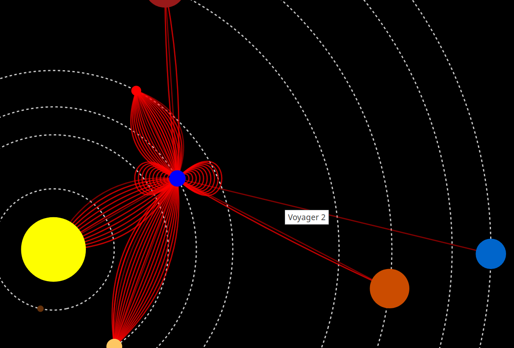
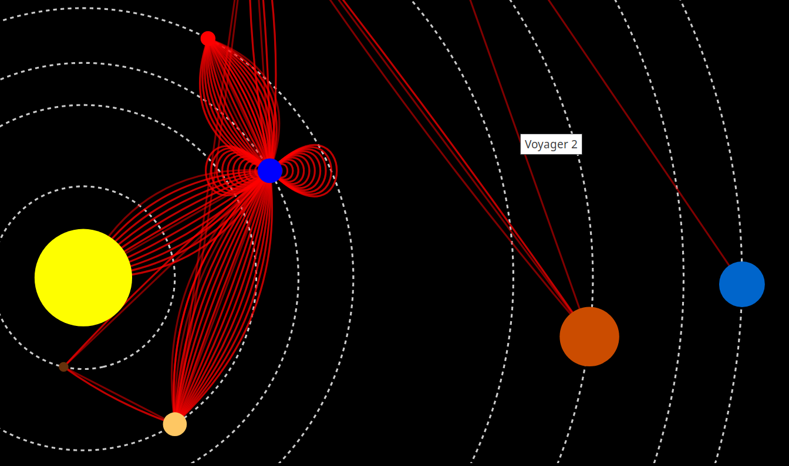

# Astronomy Visualization

<!-- # Process Book

[What to write in the process book?](https://www.dataviscourse.net/2024/project/)
In general:
- New ideas and things that inspired us (papers, visualizations, etc).
- Suggestions or ideas of possible modifications on the proposal.
- Description on how we did the data scaping, cleanup, etc, and initial visualizations on the data to explore it before starting to code, and how that affected some design decisions.
- Design evolution, options considered, decisions taken, justifications.
- Intent and functionality of the different design and interaction elements once implemented.
- Evaluation: What did we learn about the data? How did you answer your questions and worked in general? What can be improved? -->

## Resources used for the project proposal

* [Project Ideas Document](https://docs.google.com/document/d/1pG8MIJ63O_l-x5lxE9TWMq5bsQBWVphontCbd75LPDg/edit?usp=sharing) contains the initial questions and design ideas. 
* [Project proposal assignment (Due next Friday Sept 13)](https://www.dataviscourse.net/2024/project/#project-proposal)
* [Link for data review](https://planet4589.org/space/gcat/index.html): use this to get an idea of what data is available to design the visualizations.

## Resources for design

- [Nasa Solar System Viewer](https://science.nasa.gov/solar-system/kuiper-belt/) for inspiration.
- [Earth orbit artificial objects viewer](https://whatsin.space/) for inspiration.
- [Solar System Viewer](https://www.solarsystemscope.com/) for inspiration.
- [How to choose colors for the visualizations?](https://blog.datawrapper.de/which-color-scale-to-use-in-data-vis/)

## Resources for development
- [Render millions of datapoints with D3](https://blog.scottlogic.com/2020/05/01/rendering-one-million-points-with-d3.html)

## TA advices

- Start early.
- Modify your proposal if needed (will prbly happen).
- Group communication is key.
- Think of the feature usefulness to the intended target audience before adding it.

## Technology exploration
Oct 5, 2024
Author: Simon Gonzalez

We explored different options for the project, weighting the pros and cons of adding extra layers of complexity:
- Node.js could be used if we want to have a server to store the data and do some kind of processing. However, at this stage, it seems that we can get away with just using static data files.
- Frontend frameworks (mainly React and Tailwind for css) could be used to make a more organized project and achieve an overall better interface with less code, by importing ready-made components. However, at this stage, there aren't going to be (probably) that many components, and very little reutilization of them.
- HTML, CSS and JS: would yield a ligher project, with barely any dependency (d3.js). Easier to work with locally with only the tools reviewed in class. A possible disadvantage is that, if we are not careful, the code (and mainly the css styles) could get messy.

For the moment, we chose the last option and try to maintain a clean code base. If needed, we can add a framework in the future. As we will use d3 with any alternative, we will decouple the d3 code from the rest as much as possible so switching to a framework isn't that problematic.

## First prototype
Oct 11, 2024
Author: Simon Gonzalez

A barebones version of the project was created with pure HTML, CSS and JS. The main goal was to be able to visualize our data and start working on the d3 code. The first version only has a map of the solar system with log scales and colored planets with names in tooltips in a dark background. With this as a base, we can start adding other elements and trying design ideas.

## Data Collection
12 Oct 2024

Author: Mathew Whitaker

Data was collected from a catalog by Jonathan McDowell, an astronomer at the Harvard-Smithsonian Center for Astrophysics. The catalog contains information about all known artificial objects both in orbit around the Earth and on eep space missions, current and historical. The data was collected from the [General Catalog of Artificial Space Objects](https://planet4589.org/space/gcat/index.html). The data is in a CSV format and contains information about the object's name, launch date, launch site, and orbits, as well as a lot of supplementary data including details about planets, moons, comets, and asteroids.

Full documentation is available at the following link:
[General Catalog of Artificial Space Objects](https://planet4589.org/space/gcat/index.html)

We are using the following catalogs within McDowell's dataset:
 - `worlds` Gives information about planets, asteroids, and other worlds visited by spacecraft.
 - `satcat` Contains information about all known and officially documented artificial objects that have been to space.
 - `auxcat` Contains information about objects that have been to space but are not officially cataloged by the US government.
 - `lcat` Contains information about all known launches.
 - `ecat` Contains information about phase changes of objects while in orbit around various bodies in space.
 - `deepcat` Contains spacecraft events which occur in "deep space" (beyond typical Earth orbits).
 - `lprcat` Contains spacecraft events which occur near the moon or other planetary bodies.
 - `hcocat` Contains spacecraft events for spacecraft in orbit around the Sun.

We also use supplementary data from NASA's Jet Propulsion Laboratory (JPL), specifically, we download ephimerides data for the planets in the solar system. This data is used to calculate the positions of the planets at any given time.

The data is downloaded using a python file `process_data.py` that will also perform data cleaning.

## Data Cleaning
17 Oct 2024
Author: Mathew Whitaker

The GCAT data uses several unique standards for dates, numerical values, and IDs, so the majority of the data cleaning involved reading in the values and parsing the format according to McDowell's specifications. The data was then saved in a JSON format for easier access from JavaScript.

Specifically, the data cleaning involved:
 - Parsing McDowell's "vague date" format into an ISO-8601 formatted date and a precision value.
 - Mapping the relationship between objects and their parent objects (space missions often involve rockets with multiple components, discarded components, counterweights, etc. in addition to the primary payload).
 - Deciding which object involved in a mission is the "primary" payload (human payloads > pressurized payloads > general payloads > rocket components).

## Calculating Planetary Positions
24 Oct 2024
Author: Mathew Whitaker

My original attempt at writing code to calculate the current position of the planets was not successful. After revisiting the code, I noticed the following issues, which each compounded to give drastically incorrect results:
 - The code was inconsistent in its use of time units (years vs. days), which made converting from one to the other ambiguous.
 - Some orbital elements wrap from 360 to 0 degrees (or vice versa), which was not accounted for in my linear fits.
 - Some of the logic was incorrect, such as the calculation of the mean anomaly.
 - The JPL ephimerides data for Earth has some strange computational artifacts due to the coordinate system being based on the Earth's autumnal equinox. My code did not account for this.

After fixing these issues, our code now correctly calculates the positions of the planets at any given time. The code is written in Python and is available in the `calculate_planetary_positions.py` file. The code uses the JPL ephimerides data for the planets in the solar system to calculate the positions of the planets at any given time, as compared to other online planetarium software.
 
## Prototype with Planetary Positions
24 Oct 2024
Author: Mathew Whitaker

The prototype now displays the planets in their current relative position:

## Prototype with Mission paths
24 Oct 2024
Author: Simon Gonzalez

With the new planetary positions, we drew the paths of our missions dataset. The paths are non trivial since missions entail several phases and pieces (e.g. rocket parts, payload, rover, etc). As the first prototype of the mission paths, I only drew the paths of the missions destined to certain planets. We do have the data for other bodies, but we still need to place them in the map.

I tried two options:
- A path from the launch to the intended destination

- Several curves following all the planet orbits visited. For example, Voyager 2 visited Jupiter, Saturn, Uranus and Neptune.

We estimate that the first option could result in less clutter, but it looses some interesting information. For example, Voyager visited several planets on its way to the outer solar system, and that path would be lost in the first option.

Some implementation details are:

- The curves were drawn with two or three control point bezier curves, spaced evenly.

- Both the mission paths and the planets display their corresponding name on hover.

- Zooming in and out was added to the map.

Some failed implementation attempts:

- Using d3 force simulation but forcing fixed node positions. This was tried in order to avoid curve overlapping without having to calculate the control points of the curves manually. However, it interfered with the other elements of the plot in a way that was hard to control.

- Using cytoscape to draw the paths. With a similar idea than above (having a more organized set of edges with additional functionality), cytoscape was tried. However, the same problem as above was found, and the library was discarded for the moment.

## Prototype with Time Slider
25 October 2024
Author: Matthew Whitaker

By adding an HTML range input, we add an interactive component to the solar system dashboard, allowing users to change the current date, which updates the planetary positions. The design is a bit clunky, but it does work.

